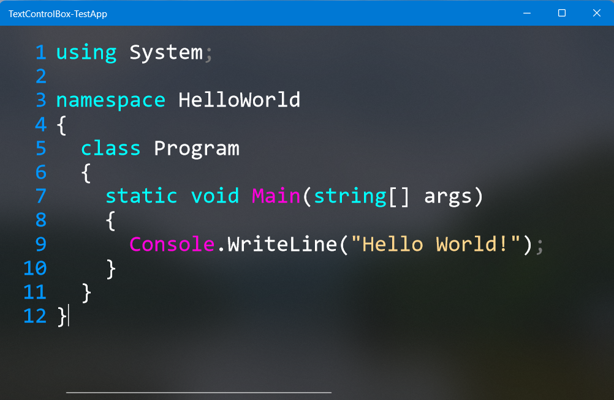

<h1>TextControlBox-UWP</h1>

<h3 align="center">An UWP based textbox with Syntaxhighlighting and support for very large amount of text which is still in development and not done yet.</h3>

## Reason why I built it
UWP has a default Textbox and a RichTextBox. Both of them are very slow in rendering multiple thounsand lines. The selection works also very slow. So I decided to create my own version of a Textbox.

## Features:
- Open a file with a million lines or more without laggs
- Syntaxhighlighting with customisation and an api to create your own Regex patterns for it
- Outstanding performance because it only renders the lines needed to display
- Linenumbering

## Problems:
- Because all the lines are stored in a List the ram usage with a million lines ore more is pretty high.

## Contributors:
If you want to contribute for this project, feel free to open an <a href="https://github.com/FrozenAssassine/TextControlBox-UWP/issues/new">issue</a> or a <a href="https://github.com/FrozenAssassine/TextControlBox-UWP/pulls">pull request</a>.
#
#### The Control is not done yet and should not be used in production. There are many features missing and not everything works without crashing sometimes. I'll do my very best to make it work properly.
#

