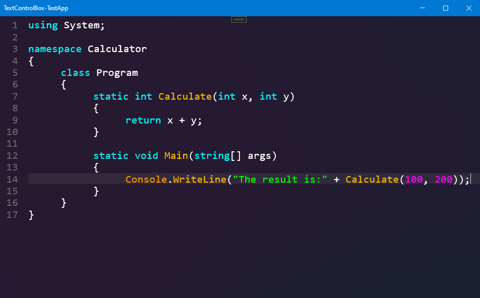

<div align="center">

<h1>TextControlBox-UWP</h1>
</div>

<div align="center">


</div>

<h3 align="center">A UWP based textbox with Syntaxhighlighting and support for very large amount of text which is still in development and not done yet.</h3>

## Reason why I built it
UWP has a default Textbox and a RichTextBox. Both of them are very slow in rendering multiple thousand lines. The selection works also very slow. So I decided to create my own version of a Textbox.

## Info:
The textbox is mostly done, but there are still some bugs where I'm working on.

## Features:
- Viewing files with a million lines or more without performance issues
- Syntaxhighlighting
- Outstanding performance because it only renders the lines that are needed to display
- Linenumbering
- Linehighlighter
- Json to create custom syntaxhighlighting
- Highly cusomizable

## Problems:
- Multiple longer lines with 5000 characters and more are currently slowing down the rendering 
- Because all the lines are stored in a List the ram usage with a million lines or more is pretty high.
- Current text limit is 100 million characters
- Currently there is no textwrapping

## Usage:

<details><summary><h2>Properties</h2></summary> 
 
 ```
- ScrollBarPosition (get/set)
- CharacterCount (get)
- NumberOfLines (get)
- CurrentLineIndex (get)
- SelectedText (get/set)
- SelectionStart (get/set)
- SelectionLength (get/set)
- ContextFlyoutDisabled (get/set)
- ContextFlyout (get/set)
- CursorSize (get/set)
- ShowLineNumbers (get/set)
- ShowLineHighlighter (get/set)
- ZoomFactor (get/set)
- IsReadonly (get/set)
- Text (get/set)
- RenderedFontSize (get)
- FontSize (get/set)
- FontFamily (get/set)
- Cursorposition (get/set)
- SpaceBetweenLineNumberAndText (get/set)
- LineEnding (get/set)
- SyntaxHighlighting (get/set)
- CodeLanguage (get/set)
- RequestedTheme (get/set)
- Design (get/set)
  ```
</details>
<details>
  <summary><h2>Functions</h2></summary>
 
  ```
- SelectLine(index)
- GoToLine(index)
- SetText(text)
- LoadText(text)
- Paste()
- Copy()
- Cut()
- GetText()
- SetSelection(start, length)
- SelectAll()
- ClearSelection()
- Undo()
- Redo()
- ScrollLineToCenter(line)
- ScrollOneLineUp()
- ScrollOneLineDown()
- ScrollLineIntoView(line)
- ScrollTopIntoView()
- ScrollBottomIntoView()
- ScrollPageUp()
- ScrollPageDown()
- GetLineContent(line)
- GetLinesContent(startline, count)
- SetLineContent(line, text)
- DeleteLine(line)
- AddLine(position, text)
- FindInText(pattern)
- SourroundSelectionWith(value)
- SourroundSelectionWith(value1, value2)
- DuplicateLine(line)
- FindInText(word, up, matchCase, wholeWord)
- ReplaceInText(word, replaceword, up, matchCase, wholeword)
- ReplaceAll(word, replaceword, up, matchCase, wholeword)
- RemoveCodeLanguageFromBuffer(identifier)
- LoadCodeLanguageFromJsonToBuffer(path, identifier)
- GetCodeLanguageFromJson(path)
- LoadCodeLanguageFromJson(path)
- SelectCodeLanguageById(identifier)
- Unload()
  ```
</details>

## Create custom syntaxhighlighting languages with json:
```json
{
  "Highlights": [
    {
      "CodeStyle": { //optional delete when not used
        "Bold": true, 
        "Underlined": true, 
        "Italic": true
      },
      "Pattern": "REGEX PATTERN",
      "ColorDark": "#dd00dd", //color in dark theme
      "ColorLight": "#dd00dd" //color in light theme
    },
  ],
  "Name": "Batch",
  "Description": "Syntax highlighting for Batch language",
  "Author": "Julius Kirsch"
}  
```

### To bind it to the textbox you can use one of these ways:
```cs

TextControlBox textbox = new TextControlBox();

//first:
await textbox.LoadCodeLanguageFromJson("PATH TO YOUR FILE");

//second:
await textbox.LoadCodeLanguageFromJsonToBuffer("PATH TO YOUR FILE", "IDENTIFIER");
textbox.SelectCodeLanguageById("IDENTIFIER");

//third
JsonLoadResult result = await GetCodeLanguageFromJson("PATH TO YOUR FILE");
textbox.CodeLanguage = result;
```

## Create custom designs in C#:
```cs
textbox.Design = new TextControlBoxDesign(
    new SolidColorBrush(Color.FromArgb(255, 30, 30, 30)), //Background brush
    Color.FromArgb(255, 255, 255, 255), //Text color
    Color.FromArgb(100, 0, 100, 255), //Selection color
    Color.FromArgb(255, 255, 255, 255), //Cursor color
    Color.FromArgb(50, 100, 100, 100), //Linehighlighter color
    Color.FromArgb(255, 100, 100, 100), //Linenumber color
    Color.FromArgb(0, 0, 0, 0) //Linenumber background
    );
```


## Contributors:
If you want to contribute for this project, feel free to open an <a href="https://github.com/FrozenAssassine/TextControlBox-UWP/issues/new">issue</a> or a <a href="https://github.com/FrozenAssassine/TextControlBox-UWP/pulls">pull request</a>.

#



